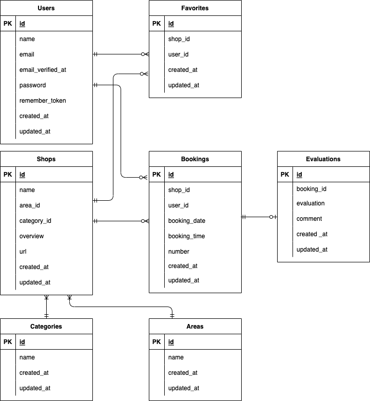

# RESE

## 1.URL

Heroku デプロイ\_URL： https://aqueous-wildwood-93146.herokuapp.com/

## 2.概要

ある企業のグループ会社の飲食店予約サービス

## 3.制作背景・目的

外部の飲食店予約サービスは手数料を取られるので自社で予約サービスを持ちたい。

## 4.使用画面のイメージ

-   飲食店一覧ページ
    

-   会員登録ページ
    

-   サンクスページ
    

-   ログインページ
    

-   マイページ
    

-   飲食店詳細ページ
    

-   予約完了ページ
    

## 5.使用技術、バージョン

-   フロントエンド
    -   HTML / CSS / JavaScript
    -   jQuery 3.5.1
-   バックエンド
    -   PHP 8.1.7
    -   Laravel 8.83.12
-   インフラ・その他
    -   MySQL 5.7.34
    -   Heroku
    -   Visual Studio Code
    -   draw.io

## 6.環境構築手順

1. コピーしたソースコードを保存したいディレクトリに「cd」コマンドで移動後、以下のようにコマンドを入力します。
    
    `git clone https://github.com/jing-bay/rese.nihira.git`

    ※コピーしたディレクトリ内を確認した時、README.mdだけがディレクトリ内に存在する場合、「cd」コマンドでコピーしたディレクトリに移動後、以下のようにコマンドを入力します。

    `git checkout main`

2. vender ディレクトリは管理対象外なので、改めて install する

   （composer をダウンロードしていない場合は先にしておくこと）

   `$ composer install`

3. .env を作る

   `$ copy .env`

4. .env の APP_KEY を作る

   `$ php artisan key:generate`

5. .env の APP_NAME を変更

   APP_NAME = RESE

6. .env の APP_URL を変更

   ローカルの場合はポート番号も含める

   APP_URL=http://localhost:8000

7. MySQL などににログインしてDBを作る

   DB 名：resedb

8. .env に DB 情報を記載する

   DB_CONNECTION=mysql

   DB_HOST=127.0.0.1

   DB_PORT=3306

   DB_DATABASE=resedb

   DB_USERNAME=root

   DB_PASSWORD=root
   
   ※今回メール認証機能はMailtrapの使用を想定しています。
   
   適宜Mailtrapのアカウントを登録し、.envを変更してください。

9. DB のテーブルを作り、シーディングする

   `$ php artisan migrate`

   `$ php artisan db:seed`

10. ファイルの中でサーバーを立ち上げる

   `$ php artisan serve`

## 7.機能一覧

-   ユーザー登録関連
    -   ログイン・ログアウト
    -   会員登録の際メール認証する
-   飲食店表示関連
    -   飲食店一覧取得
    -   飲食店詳細取得
    -   飲食店検索機能（エリア・ジャンル・キーワード）
-   マイページ関連
    -   飲食店お気に入り登録・削除
    -   飲食店予約情報追加・変更・削除
    -   評価機能追加・削除

## ８.工夫したところ

競合アプリケーションは機能や画面が複雑で使いづらいため、シンプルにした。

## 9.苦労した点

heroku へのマイグレーションがなかなかうまくいかなかったこと。

また、最後の最後でHerokuにデプロイしたら画像が非表示になったこと。

## 10.DB 設計

### ER 図

### テーブル設定

#### users テーブル

ユーザーを管理する。

| カラム名          | 属性                                 | 役割                                   |
| ----------------- | ------------------------------------ | -------------------------------------- |
| id                | unsigned bigint/PRIMARY KEY/NOT NULL | ユーザーを識別する ID                  |
| name              | varchar(255)/NOT NULL                | ユーザー名                             |
| email             | varchar(255)/UNIQUE KEY/NOT NULL     | メールアドレス                         |
| email_verified_at | timestamp                            | メール認証用                           |
| password          | varchar(255)/NOT NULL                | パスワード                             |
| remember_token    | varchar(100)                         | ユーザーのトークンを格納するために使用 |
| created_at        | timestamp                            | 作成日時                               |
| updated_at        | timestamp                            | 更新日時                               |

#### shops テーブル

飲食店情報を管理する。

| カラム名    | 属性                                 | 役割                  |
| ----------- | ------------------------------------ | --------------------- |
| id          | unsigned bigint/PRIMARY KEY/NOT NULL | 飲食店を識別する ID   |
| name        | varchar(255)/NOT NULL                | 店名                  |
| area_id     | unsigned bigint/NOT NULL             | 地域を識別する ID     |
| category_id | unsigned bigint/NOT NULL             | ジャンルを識別する ID |
| overview    | text/NOT NULL                        | 概要                  |
| shopimg     | varchar(255)/NOT NULL                | お店の画像            |
| created_at  | timestamp                            | 作成日時              |
| updated_at  | timestamp                            | 更新日時              |

#### areas テーブル

飲食店のエリアを管理する。
| カラム名 | 属性 | 役割 |
| ---- | ---- | ---- |
| id | unsigned bigint/PRIMARY KEY/NOT NULL | エリアを識別する ID |
| name | varchar(255)/NOT NULL | エリアの名前 |
| created_at | timestamp | 作成日時 |
| updated_at | timestamp | 更新日時 |

#### categories テーブル

飲食店のジャンルを管理する。
| カラム名 | 属性 | 役割 |
| ---- | ---- | ---- |
| id | unsigned bigint/PRIMARY KEY/NOT NULL | ジャンルを識別する ID |
| name | varchar(255)/NOT NULL | ジャンルの名前 |
| created_at | timestamp | 作成日時 |
| updated_at | timestamp | 更新日時 |

#### bookings テーブル

予約情報を管理する。
| カラム名 | 属性 | 役割 |
| ---- | ---- | ---- |
| id | unsigned bigint/PRIMARY KEY/NOT NULL | 予約情報を識別する ID |
| shop_id | unsigned bigint/NOT NULL | 飲食店を識別する ID |
| user_id | unsigned bigint/NOT NULL | ユーザーを識別する ID |
| booking_date | date/NOT NULL | 予約日 |
| booking_time | time/NOT NULL | 予約時間 |
| number | unsigned tinyint/NOT NULL | 予約人数 |
| created_at | timestamp | 作成日時 |
| updated_at | timestamp | 更新日時 |

#### favorites テーブル

お気に入り情報を管理する。
| カラム名 | 属性 | 役割 |
| ---- | ---- | ---- |
| id | unsigned bigint/PRIMARY KEY/NOT NULL | お気に入り情報を識別する ID |
| shop_id | unsigned bigint/NOT NULL | 飲食店を識別する ID |
| user_id | unsigned bigint/NOT NULL | ユーザーを識別する ID |
| created_at | timestamp | 作成日時 |
| updated_at | timestamp | 更新日時 |

#### evaluations テーブル

評価を管理する。評価は予約した店舗に行った後のみ行える
| カラム名 | 属性 | 役割 |
| ---- | ---- | ---- |
| id | unsigned bigint/PRIMARY KEY/NOT NULL | 評価情報を識別する ID |
| booking_id | unsigned bigint/NOT NULL | 予約情報を識別する ID |
| evaluation | unsigned tinyint/NOT NULL | 5 段階評価 |
| comment | text/NOT NULL | コメント |
| created_at | timestamp | 作成日時 |
| updated_at | timestamp | 更新日時 |
